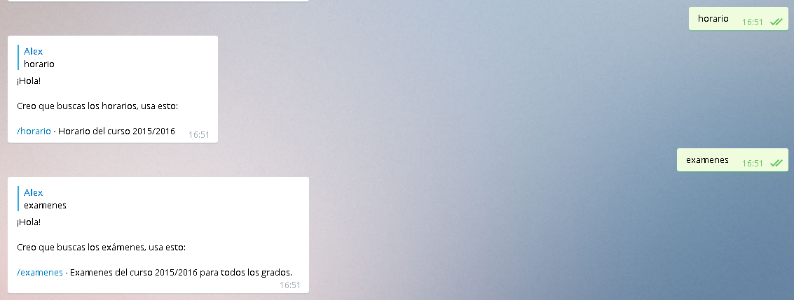
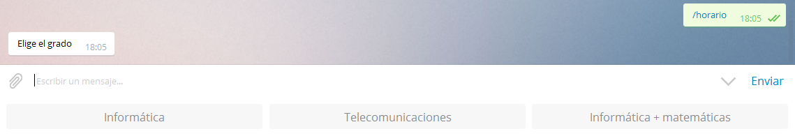
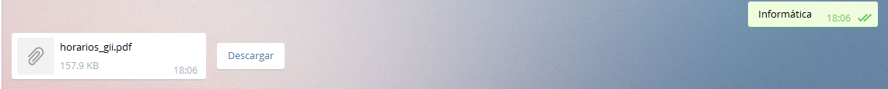

# ETSIIT BOT
Bot de telegram sobre la ETSIIT de la universidad de Granada

Nombre del bot: @ETSIITBOT

Por una serie de problemas con el host, el bot puede no estar disponible

Por motivos de privacidad de los usuarios el bot no puede ser incluido en grupos.

La idea de este bot es proporcionar información sobre la escuela de manera simple y sencilla.

##Funcionalidades

ETSIITBOT ahora es un poquito mas inteligente, al detectar la palabra horario y/o exámenes en el mensaje
sin necesidad de / te responderá indicando como obtener lo que buscas

La interacción con ETSIITBOT ahora se realiza de una manera mas natural.

Tras seleccionar el grado del que queramos el horario ETSIITBOT nos lo enviará

* /horario - Ofrece los diferentes horarios a traves de un teclado
* /examenes => Proporciona los examenes del curso 2015/2016 para todos los grados.
* /examenes_gii =>Examenes del curso 2015/2016 para  el grado de ingeniería informática.
* /examenes_gitt => Examenes del curso 2015/2016 ara el grado de ingeniería en telecomunicaciones.
* /localizacion => Localización de la escuela en google maps.
* /contacto => Información de contacto de la escuela.
* /web => Web de la escuela
* /menu_semana => Menú de la semada de los comedores de la ugr
* /menu_dia => Menú del día seleccionado
* /ayuda => Información detallada sobre las funciones.

##Contacto
acasadoquijada@gmail.com

[Licencia](https://github.com/acasadoquijada/ETSIIT_BOT/blob/master/LICENSE)
